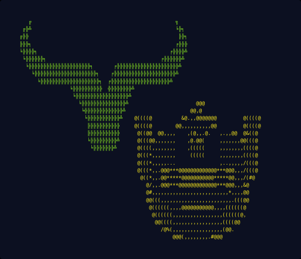

# Yack Runner Bob

POC of bottom of the block arbitrage using YakSwap on SUAVE.



## Requirements 

* Foundry 
* Synced Holesky node

## Setup

### SUAVE

Consult [SUAVE docs](https://suave-alpha.flashbots.net/) to set up local SUAVE network and connect it to the builder node (suave-execution-geth).

Instead of using vanilla suave-execution-geth, this repo uses a forked version of it, namely `https://github.com/eden-network/suave-execution-geth`.

### Install Forge dependencies

```bash
git submodule update
```

### Trading account

Add private key used in end-to-end test into `TRADER_PK` in `.env` file. Note that account associated with the private key needs to hold sufficient assets specified in `test/config/deployment-test.json`, as well as have sufficient allowance of those assets to the `YakSwap` router contract.

Note that currently setting up the account without sufficient privilliges involves deploying a new assets, pairs, adapter and router. In the future this should be more approachable.

## Usage

Run end-to-end test:

```bash
forge test --match-test test_run --ffi -vv
```

## Contributing

Feel free to contribute by opening an issue or a pull request.

## Authors

[Brock](https://x.com/zeroXbrock) & [Miha](https://twitter.com/MihaLotric)